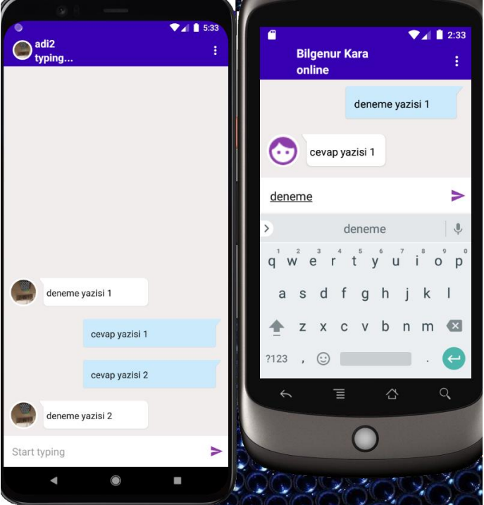
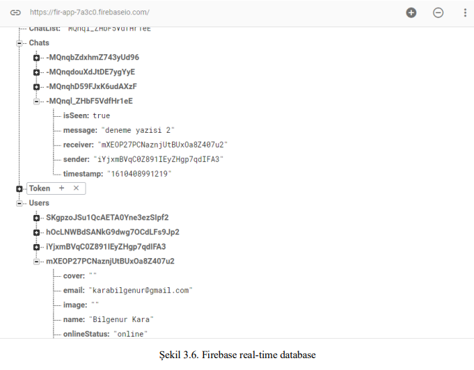
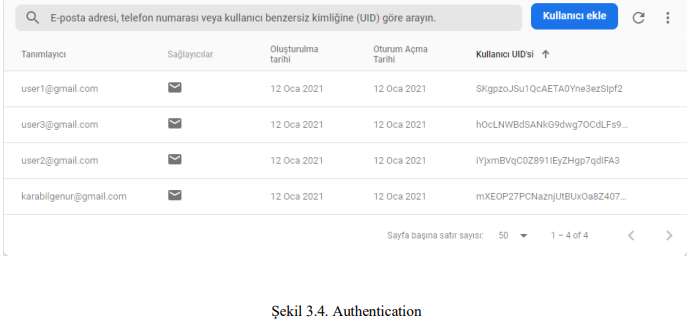
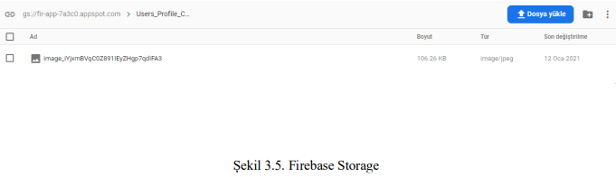

- Android Studio platformuyla java dili vasıtasıyla yazılmıştır. 
- No sql veri tabanı için Firebase kullanılmıştır. 
Firebase eklentileri olan FCM ile bildirim mekanizması oluşturulmuş, 
storage ile resim bilgileri tutulmuş, 
authentication ile kullanıcı doğrulaması yapılmış ve kullanıcı bilgileri real-time database’e kaydedilmiştir. 
- Uygulamaya kullanıcılar kayıt olabilir veya giriş yapabilir
- Uygulamaya kaydolan kullanıcılar bir ekranda listelenir
- Kullanıcıların listelendiği ekranda kullanıcıların son görülme tarihi bulunur. Arama işlemi yapılabilir.
- Bir kullanıcıya mesaj gönderildiğinde bildirim işlemi gerçekleşir

 Firebase 

